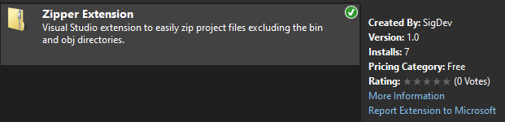
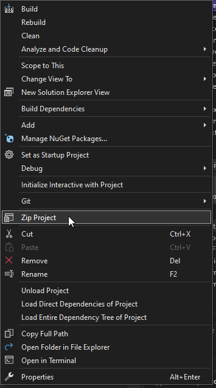
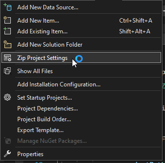
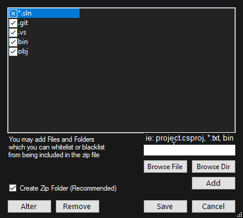

# VSZipperApp
A Visual Studio extension for fast and easy project zipping excluding unnecessary obj and bin directories.

## How to install:
Click on the Extensions tab and search for "Zipper Extension" Created by: SigDev. Once you download, you should be ready to go!

## How to use:
Right click on the project or solution you want to Zip and select the "Zip Project" or "Zip Solution" option.

A folder containing all your zip files will be automatically created within your projects directory
(this can be changed in the "Zip Project Settings" option in the project tab).
You may change the directories/files to exclude from your zip in the settings.

